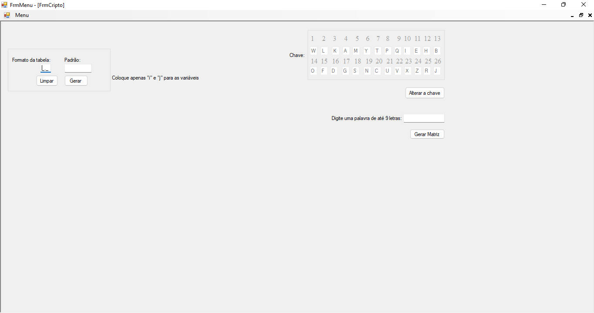

# Projeto de Matrizes




## Introdução

Esse é um projeto simples feito com C# utilizando o visual studio 2022, ele foi desenvolvido para ajudar nossa professora de matemática a mostrar os cálculos entre matrizes de uma forma mais intuitiva e legal.

## 💻 Pré-requisito

Antes de começar, verifique se você atendeu ao seguinte requisito:
* Você instalou a versão mais recente do visual studio.

## ☕ Usando o Projeto

Para usar o projeto de matrizes, siga estas etapas:

utilize o comando:

```
git clone https://github.com/EnzoSylvestrin/Projeto-Matrizes.git
```

e abra o projeto pelo visual studio

após isso é só rodar o projeto e pronto!

## 📫 Contribuindo para o Projeto de matrizes
Para contribuir com o projeto, siga estas etapas:

1. Bifurque este repositório.
2. Crie um branch: `git checkout -b <nome_branch>`.
3. Faça suas alterações e confirme-as: `git commit -m '<mensagem_commit>'`
4. Envie para o branch original: `git push origin Projeto-Matrizes / <local>`
5. Crie a solicitação de pull.

Como alternativa, consulte a documentação do GitHub em [como criar uma solicitação pull](https://help.github.com/en/github/collaborating-with-issues-and-pull-requests/creating-a-pull-request).
